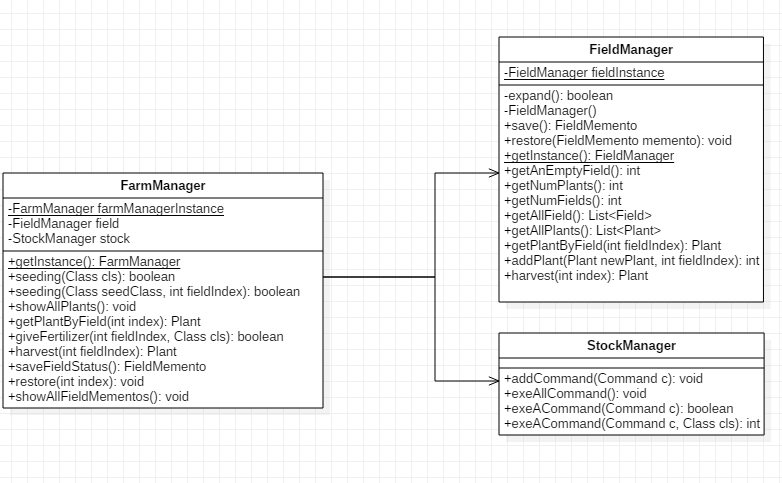
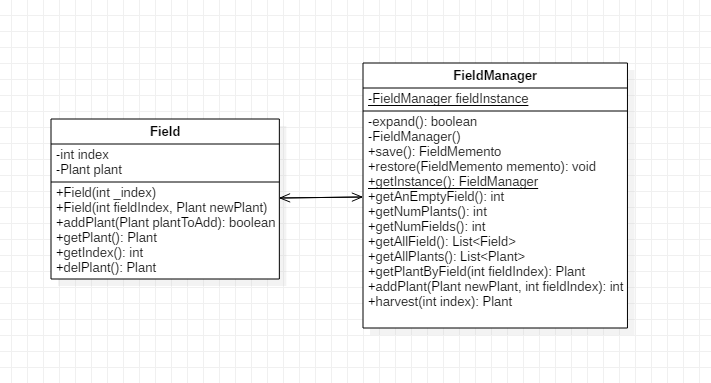

1 Factory Method Pattern

1.1 API描述

我们将该模式运用于植株的种植过程，PlantFactory实现了 Factory Method模式，判断输入后可以在grow();函数中生产3种不同的plant：Corn、Potato、Wheat。

1.2 类图

3 Mediator Pattern

3.1 API描述

在FarmManager中使用中介者模式，作为StockManager和FieldManager类的中介者，使其直接和中介者(FarmManager类)进行交互。

3.2 类图

4 Proxy Pattern

4.1 API描述

在农场的设计中，我指派PlantFactory和Field进行工作，而FarmManager本身无需工作，此时FarmManager代理所有PlantFactory和Field的所有操作，且无法在farm包外访问。

4.2 类图

5 Singleton Pattern

5.1 API描述

实现一个Field类，该田地在全局只有一个。主要函数是addPlant()：添加植物、getPlant()：取得植物、getIndex()：取得这块田的索引和delPlant()：删除植物。

5.2 类图

6 Flyweight Pattern

6.1 API描述

通过SeedPlantProductParser来实现从seed到plant再到product的过程，通过这种设计模式避免重新的创建和占用内存。

6.2 类图

7 Composite Pattern

7.1 API描述

我们在种植这一过程中使用Composite设计模式，Filed类中包含Plant，FieldManager类中包含Field。FieldManager和StockManager组成FarmManager。

7.2 类图

8 Command Pattern

8.1 API描述

在种植植株的时候，采用Command设计模式，StockManager执行FarmManager的命令，执行对象为另一个包的仓库。

8.2 类图

9 Memento Pattern
9.1 API描述

备忘录模式就FieldMemento类，用于存储植物的当前状态，每一个植物都对应一个FieldMemento类，FieldMementoManager就是FieldMemento的管理类。FieldMemento备份FieldManager的fieldList数据，由FieldMemengtoManager管理，多种的全部拔掉。其中FieldMementoManager的展示所有备忘录函数。

9.2 类图

