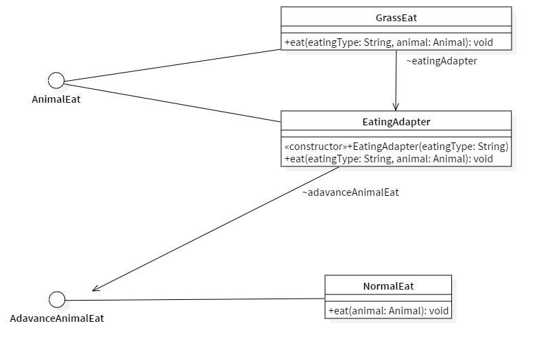
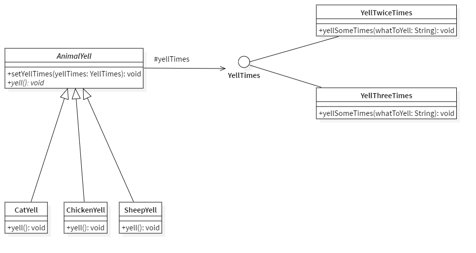
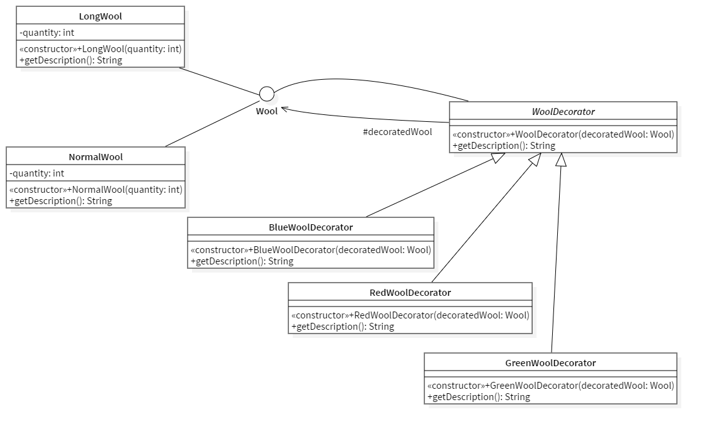
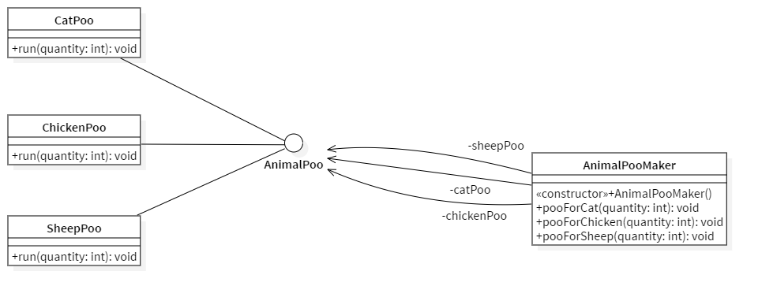
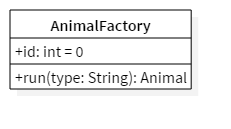
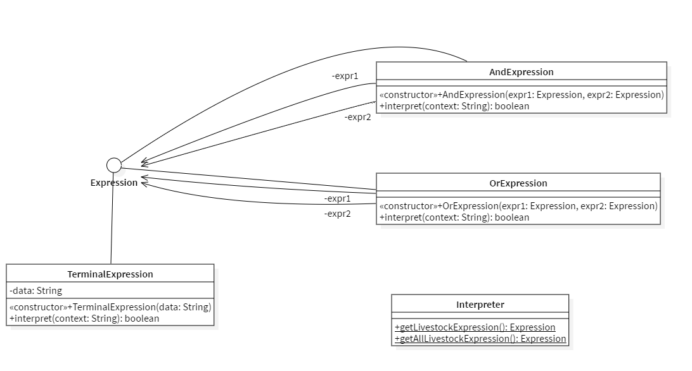
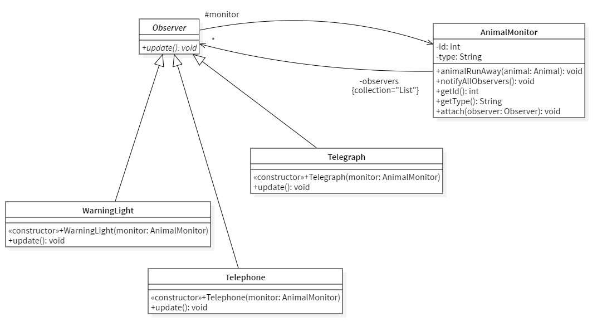
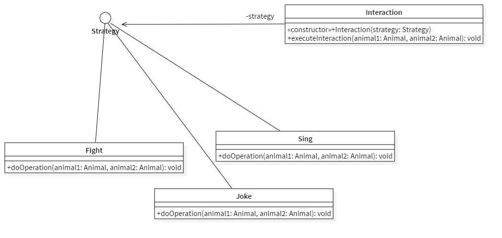

[TOC]

## Adapter Pattern

### 设计模式简述

​	在软件开发中采用类似于电源适配器的设计和编码技巧被称为适配器模式。
​	通常情况下，客户端可以通过目标类的接口访问它所提供的服务。有时，现有的类可以满足客户类的功能需要，但是它所提供的接口不一定是客户类所期望的，这可能是因为现有类中方法名与目标类中定义的方法名不一致等原因所导致的。
​	在这种情况下，现有的接口需要转化为客户类期望的接口，这样保证了对现有类的重用。如果不进行这样的转化，客户类就不能利用现有类所提供的功能，适配器模式可以完成这样的转化。
在适配器模式中可以定义一个包装类，包装不兼容接口的对象，这个包装类指的就是适配器(Adapter)，它所包装的对象就是适配者(Adaptee)，即被适配的类。
​	适配器提供客户类需要的接口，适配器的实现就是把客户类的请求转化为对适配者的相应接口的调用。也就是说：当客户类调用适配器的方法时，在适配器类的内部将调用适配者类的方法，而这个过程对客户类是透明的，客户类并不直接访问适配者类。因此，适配器可以使由于接口不兼容而不能交互的类可以一起工作。这就是适配器模式的模式动机。

### API 描述

我们有一个 `AnimalEat` 接口和一个实现了 `AnimalEat` 接口的实体类 `grassEat`。因为草是无限的不需要购买, 所以， `grassEat` 可以执行羊的吃的方法。

我们还有另一个接口 `AdvancedAnimalEat` 和实现了 `AdvancedAnimalEat` 接口的实体类 `NormalEat`。该类可以执行其他动物的吃的方法(因为除草之外, 其他动物的事物都需要购买而来)。

我们想要让 `grassEat` 也可以执行其他动物吃的动作。为了实现这个功能，我们需要创建一个实现了 `AnimalEat` 接口的适配器类 `EatingAdapter`，并使用 `AdvancedAnimalEat` 对象来执行所需的动作。

`grassEat` 使用适配器类 `EatingAdapter` 传递所需的eat的类型，不需要知道执行吃的方法的实际类。 

|函数名|作用|
|:---:|:--:|
|`eat()`|进行吃的动作|

#### 使用例

```java
grassEat.eat("Grass", sheep);
grassEat.eat("Normal", cat);
grassEat.eat("Normal", chicken);
```

```bash
There are infinity Grass in store, and the Sheep needs 1 Grass.
Animal (id: 2) have eaten 1 Grass!
There are 2 CatFood in store, and the Cat needs 2 CatFood.
Animal (id: 1) have eaten 2 CatFood!
There are 2 ChickenFood in store, and the Chicken needs 3 ChickenFood.
Animal (id: 3) have eaten 2 ChickenFood!
```

### uml类图
 


## Bridge Pattern

### 设计模式简述

​	桥接模式即将抽象部分与它的实现部分分离开来，使他们都可以独立变化。桥接模式将继承关系转化成关联关系，它降低了类与类之间的耦合度，减少了系统中类的数量，也减少了代码量。

### API 描述

动物会发叫. 不同的动物会发出不同次数的叫声和不同类型的叫声. 这样就有了两个维度: 猫的叫的方式有叫两次和叫三次的不同, 同样, 羊叫的方式也有叫两声和叫三声之分. 于是在`AnimalYell`的`yell()`中, 并没有具体的实现`yell`的方法, 而是调用接口`yellTimes`来进行实现. 

|函数名|作用|
|:---:|:--:|
|`yell()`|进行叫的动作|
|`setYellTimes()`|设定叫的次数|

#### 使用例

```java
System.out.println("Let the cat to yell 3 times..");
AnimalYell catYell = new CatYell();
YellTimes yellThreeTimes = new YellThreeTimes();
catYell.setYellTimes(yellThreeTimes);
catYell.yell();
```

```bash
Let the cat to yell 3 times..
miaomiaomiaomiao
miaomiaomiaomiao
miaomiaomiaomiao
```

### uml类图



## Decorator Pattern

### 设计模式描述

​	装饰器模式（Decorator Pattern）允许向一个现有的对象添加新的功能，同时又不改变其结构。这种类型的设计模式属于结构型模式，它是作为现有的类的一个包装。这种模式创建了一个装饰类，用来包装原有的类，并在保持类方法签名完整性的前提下，提供了额外的功能。

​	装饰器模式相比生成子类更为灵活，能够扩展一个类的功能，并且可以代替继承。

### API 描述

羊可以产出羊毛. 而羊毛可以被染成其他的颜色. 这里认为是涂料与羊毛本身是无关的, 两者更像是附着在一起的关系, 而不是认为颜色是羊毛自己的属性.

|函数名|作用|
|:---:|:--:|
|`getDescription()`|获取羊毛(或者装饰后的)的信息|

#### 使用例

```java
System.out.println("Now start dyeing...");
System.out.println(
        new RedWoolDecorator(
                new BlueWoolDecorator(
                        new GreenWoolDecorator(longWool)
                )
        ).getDescription()
);
```

```bash
Now start dyeing...
This is 3 normal wool 
____And it has been set to red now.
____And it has been set to blue now.
____And it has been set to green now.
```

### uml类图




## Facade Pattern

### 设计模式描述

​	外观模式（Facade Pattern）隐藏系统的复杂性，并向客户端提供了一个客户端可以访问系统的接口。这种类型的设计模式属于结构型模式，它向现有的系统添加一个接口，来隐藏系统的复杂性。这种模式涉及到一个单一的类，该类提供了客户端请求的简化方法和对现有系统类方法的委托调用。为子系统中的一组接口提供一个一致的界面，外观模式定义了一个高层接口，这个接口使得这一子系统更加容易使用。在层次化结构中，可以使用外观模式定义系统中每一层的入口。

### API 描述

动物要进行排泄. 不同动物排泄的方式不同. 这里实现了一个`AnimalPoo`接口, 以及继承自此接口的`CatPoo`类和`ChickenPoo`以及`SheepPoo`. 同时实现了一个外观类`AnimalPooMaker`, 所有的调用均通过其进行.

|函数名|作用|
|:---:|:--:|
|`run()`|进行排泄|
|`pooForCat()`|使猫进行排泄|
|`pooForChicken()`|使鸡进行排泄|
|`pooForSheep()`|使羊进行排泄|

#### 使用例

```java
AnimalPooMaker animalPooMaker = new AnimalPooMaker();
animalPooMaker.pooForCat(2);
animalPooMaker.pooForChicken(1);
animalPooMaker.pooForSheep(1);
```

```bash
The cat poo 2 cat stool.
The chicken poo 1 chicken stool.
The sheep poo 1 sheep stool.
```

### uml类图



## Factory Pattern

### 设计模式描述

工厂模式（Factory Pattern）是 Java 中最常用的设计模式之一。这种类型的设计模式属于创建型模式，它提供了一种创建对象的最佳方式。

在工厂模式中，我们在创建对象时不会对客户端暴露创建逻辑，并且是通过使用一个共同的接口来指向新创建的对象。

### API 描述

动物工厂根据参数的不同, 创建不同的动物.

|函数名|作用|
|:---:|:--:|
|`run()`|返回一个动物|

#### 使用例

```java
AnimalFactory factoryDemo = new AnimalFactory();
Animal cat = factoryDemo.run("Cat");
Animal sheep = factoryDemo.run("Sheep");
Animal chicken = factoryDemo.run("Chicken");
```

```bash
Create a new cat!
Create a new sheep!
Create a new chicken!
```

### uml类图



## Interpreter Pattern

### 设计模式简述

​	解释器模式（Interpreter Pattern）提供了评估语言的语法或表达式的方式，它属于行为型模式。这种模式实现了一个表达式接口，该接口解释一个特定的上下文。这种模式被用在 SQL 解析、符号处理引擎等。给定一个语言，定义它的文法表示，并定义一个解释器，这个解释器使用该标识来解释语言中的句子。

### Api描述

​	在这个项目中，有很多重复的加法功能，如果一种特定类型的问题发生的频率足够高，那么可能就值得将该问题的各个实例表述为一个简单语言中的句子。这样就可以构建一个解释器，该解释器通过解释这些句子来解决该问题。

|函数名 |作用|
| :--------------: | :------------------: |
| void interpret() | 实现解释器的具体操作 |

#### 使用例

```java
Expression oneLivestock = Interpreter.getLivestockExpression();
Expression allLivestock = Interpreter.getAllLivestockExpression();

System.out.println("Chicken is livestock? " + oneLivestock.interpret("Chicken"));
System.out.println("Sheep and chicken are all the livestock in pasture? "
        + allLivestock.interpret("Sheep Chicken"));
```

```bash
Chicken is livestock? true
Sheep and chicken are all the livestock in pasture? true
```

### uml类图


## Observer Pattern

### 设计模式简述

​	当对象间存在一对多关系时，则使用观察者模式（Observer Pattern）。比如，当一个对象被修改时，则会自动通知它的依赖对象。观察者模式属于行为型模式。定义对象间的一种一对多的依赖关系，当一个对象的状态发生改变时，所有依赖于它的对象都得到通知并被自动更新。

### Api描述

当有动物逃跑时, 会有电报和电话通知.

|函数名|作用|
|:---:|:--:|
|`animalRunAway()`|使一个动物逃跑|

#### 使用例

```java
AnimalMonitor monitor = new AnimalMonitor();
new WarningLight(monitor);
new Telegraph(monitor);
new Telephone(monitor);
monitor.animalRunAway(chicken);
```

```bash
Warning light! One Chicken (id: 3) has run away!
Telegraph from telegraph machine 1! One Chicken (id: 3) has run away from com.pasture! Please help searching!
Automatical telephone! One Chicken (id: 3) has run away from your com.pasture!
```

### uml类图



## Strategy Pattern

### 设计模式简述

​	Strategy模式定义并封装一系列算法，由具体对象根据场景选择不同的策略，从而调用到对应的不同算法。

​	此设计模式分离具体的算法和客户端，使得客户端可以自由切换算法，算法也可以独立于客户端自由进行更改；避免在同一算法中出现大量的条件判断，而是将原本逻辑复杂的算法拆分成多个结构相对简单的独立算法；算法可扩展性良好。但是在结构框架中需要实例化每一个新的策略类，且需要对外暴露所有的策略，复杂化了结构。

### Api描述

​不同的动物会有不同的动作

| 类名             | 描述       |
| ---------------- | ---------- |
| `executeInteraction()`| 执行动作   |

#### 使用例

```java
Interaction sing = new Interaction(new Sing());
sing.executeInteraction(cat, sheep);
Interaction joke = new Interaction(new Joke());
joke.executeInteraction(sheep, chicken);
Interaction fight = new Interaction(new Fight());
fight.executeInteraction(chicken, cat);
```

```bash
Cat(id: 1) sing to Sheep(id:2)!
Sheep(id: 2) joke on Chicken(id:3)!
Chicken(id: 3) fight with Cat(id:1)!
```

### uml类图



