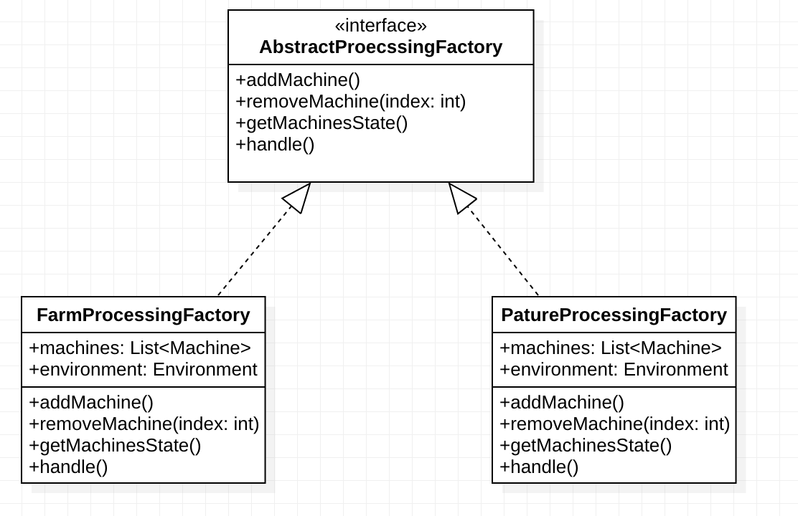
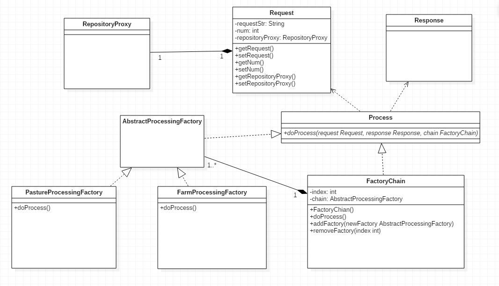
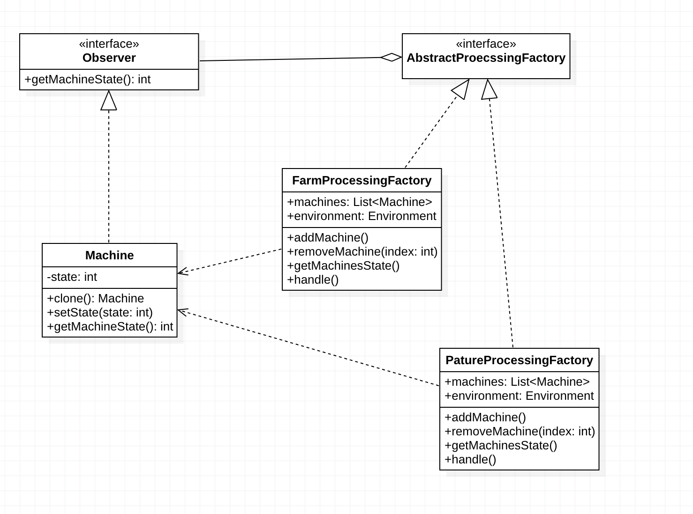
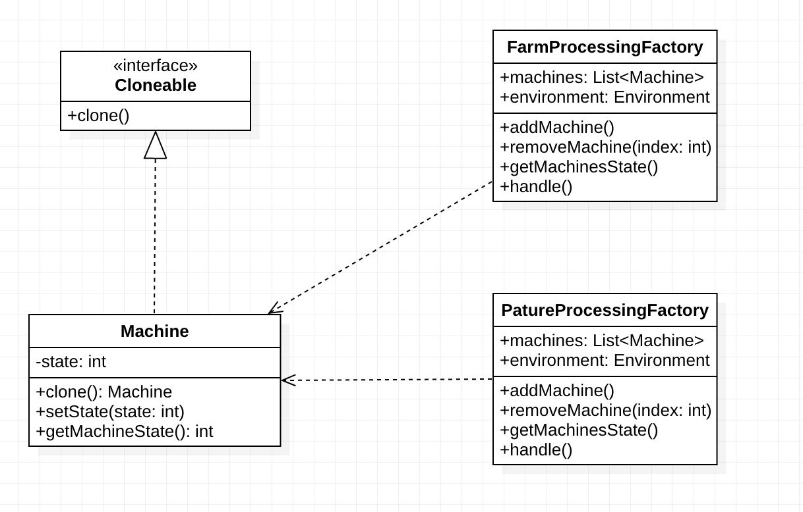
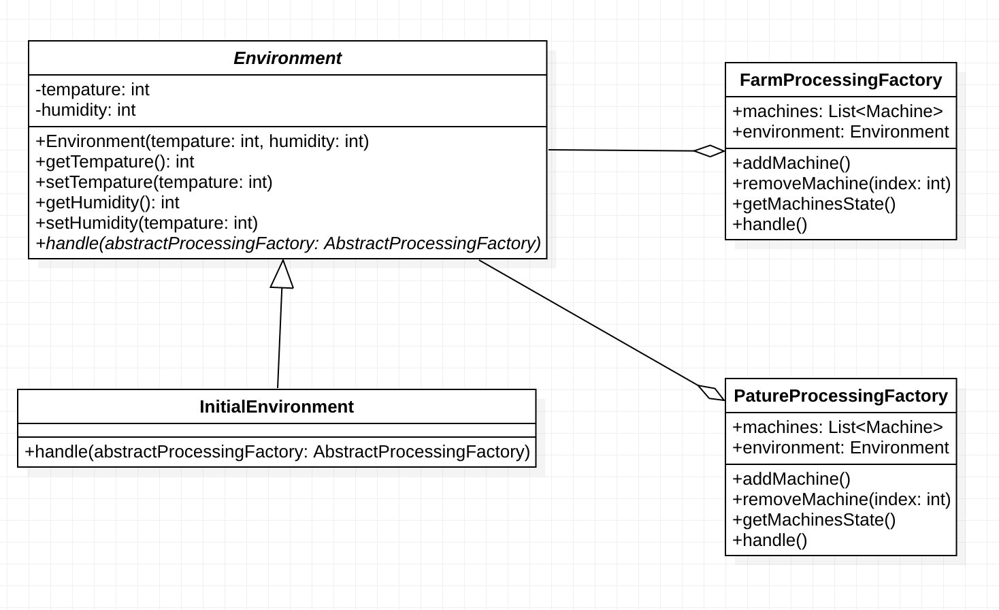
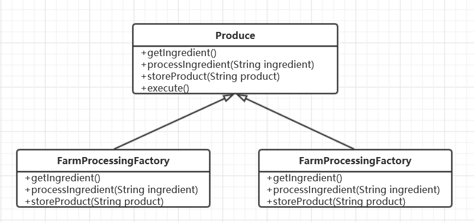
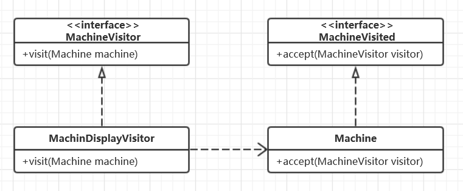

## 3.1 Abstract Factory Pattern

### 设计模式简述

​	Abstract Factory 模式提供了一个创建一系列相关或相互依赖对象的接口，而无需指定它们具体的类。十分便捷的划分了不同产品组，但是在OCP原则的规范下难以实现产品组内的扩展，但可以实现产品组的扩展。

### 3.1.1 Factory 实现API

#### 3.1.1.1 API描述

| 函数名                    | 作用                                       |
| ------------------------- | ------------------------------------------ |
| void addMachine（）       | 接口定义方法，增加机器                     |
| void removeMachine（…）   | 接口定义方法，移除机器                     |
| void getMachinesState（） | 接口定义方法，获取所有机器状态             |
| void setEnvironment（…）  | 接口定义方法，设置工厂的环境               |
| void handle（）           | 接口定义方法，根据外界环境变化调正工厂环境 |

#### 3.1.1.2 类图

## 3.5 Chain of Responsibilty Pattern

### 设计模式简述

​	在Chain of Responsibilty Pattern中，为请求创建了一个接收者对象的链。这种模式给予请求的类型，对请求的发送者和接收者进行解耦。主要的意图是使多个对象都有机会处理同一个请求，从而避免请求的发送者和接收者之间的耦合关系。将这些对象连成一条链，并沿着这条链传递该请求，直到有一个对象处理它为止。并且对于职责链上的处理者负责处理请求，客户只需要将请求发送到职责链上即可，无须关心请求的处理细节和请求的传递，所以职责链将请求的发送者和请求的处理者解耦。

### 3.5.1 API 描述

​	对于具有多样性的加工厂的加工行为，定义了两个PastureProcessingFactory、FarmProcessingFactory实现自AbstractProcessingFactory的方法，两个类分别表示牧场产品加工工厂和农产品加工工厂，每个类中有不同的doProcess用来与不同的产品配对。同时有FactoryChain类用来存储Factory并顺序执行其中的doProcess方法。在doProcess方法中，Request是请求，需要输入所生产的产品（String）、数量（int）、仓库（RepositoryProxy）。Respond是回复。FactoryChain是工厂链，需要事先把工厂添加进入。
​	主要函数如下：

| 函数名                                                       | 作用                                                         |
| ------------------------------------------------------------ | ------------------------------------------------------------ |
| void doProcess(Request request,Respond respond,FactoryChain chain) | 生产，执行时调用工厂链的方法，会顺序执行里面所有工厂的方法。 |
| boolean addFactory(AbstractPorcessingFactory new Factory)    | 往工厂链中添加工厂                                           |
| boolean removeFactory(int index)                             | 删除工厂链的工厂                                             |

### 3.5.2 类图

## 3.16 Observer Pattern

​	当对象间存在一对多关系时，则使用观察者模式（Observer Pattern）。比如，当一个对象被修改时，则会自动通知它的依赖对象。观察者模式属于行为型模式。定义对象间的一种一对多的依赖关系，当一个对象的状态发生改变时，所有依赖于它的对象都得到通知并被自动更新。

### 3.16.1 Api 描述

​	每隔一段时间工厂需要检查工厂中机器的运行情况，机器为观察者，当工厂调用getMachinesState（）方法时，每台机器都会向工厂报告运行情况。
| 函数名                  | 作用                             |
| ----------------------- | -------------------------------- |
| int getMahcineState（） | 接口定义方法，获取机器的状态     |
| int getMahcineState（） | 实现接口定义方法，获取机器的状态 |
| Void setState（）       | 返回机器的状态                   |

### 3.16.2 类图

## 3.17 Prototype Pattern

### 设计模式简述

​	原型模式（Prototype Pattern）是用于创建重复的对象，同时又能保证性能。这种类型的设计模式属于创建型模式，它提供了一种创建对象的最佳方式。

​	这种模式是实现了一个原型接口，该接口用于创建当前对象的克隆。当直接创建对象的代价比较大时，则采用这种模式。例如，一个对象需要在一个高代价的数据库操作之后被创建。我们可以缓存该对象，在下一个请求时返回它的克隆，在需要的时候更新数据库，以此来减少数据库调用。模式即将抽象部分与它的实现部分分离开来，使他们都可以独立变化。桥接模式将继承关系转化成关联关系，它降低了类与类之间的耦合度，减少了系统中类的数量，也减少了代码量。

### 3.17.1 Machine实现API

#### 3.17.1.1 API 描述

在工厂调用getMachinesState（）时，系统会产生一个随机数来修改Machine的state属性来模拟机器损坏的情况，当机器损坏时，工厂会移除该机器，然后调用Machine类的clone（）方法来产生一个新的机器。

| 函数名            | 作用                                 |
| ----------------- | ------------------------------------ |
| Machine clone（） | 重写接口方法，返回机器的一个复制对象 |

#### 3.17.1.2 类图

## 3.20 State Pattern

### 设计模式简述

​	State模式允许对象在内部状态发生改变时改变它自身的行为，提供了方便的解决复杂对象状态转换的方法、解决了不同状态下行为的封装问题。优点是在逻辑上确定并枚举可能的状态与该状态下对应的行为方法，将状态与行为做逻辑关联，使得高层模块可以直接通过更改状态实现不同行为的选择；多个环境对象可以共享同一个状态模块，实现了代码的复用。但是在原有的结构基础上增加了不同的状态类与对象类，但在实现方法上得到了精简；对OCP原则不友好，增加新的状态时必不可少的要更改切换状态的源代码。

### 3.20.1 API描述

​	 我们将外界环境定义为温度和湿度，工厂持有一个外界环境类，当外界环境发生变化时，工厂会调用外界环境类的handle（）方法来调整工厂内的温度，湿度。

| 方法                     | 作用                                               |
| ------------------------ | -------------------------------------------------- |
| abstract void handle(..) | 抽象方法，在实现类中实现该方法来处理外界环境的变化 |
| Int getTemerature（）    | 返回环境的温度                                     |
| Void setTemperature（）  | 设置环境的温度                                     |
| Int getHumidity（）      | 返回环境的湿度                                     |
| Void setHumidity（）     | 设置环境的湿度                                     |

### 3.20.2 类图

## 3.22 Template Method

### 设计模式简述

​	Template Method提供了一种在父类中定义处理流程，在子类中具体实现的处理方式，同时在具体实现时Template Method又允许子类重新定义流程的具体步骤。优点是实现了反向控制和OCP原则，既提高了代码的复用性，又可以便捷的扩展子类群（扩展性），实现无限的可能性。这个设计模式虽然提高了代码的复用性，但是每一个不同的实现都需要一个新的子类实现，从而提升了系统的复杂度。

#### 3.22.1.1 API描述

​	通过模板模式在工厂中加工商品，使用抽象类Produce定义了加工商品的三个基本步骤，取出原材料，加工产品，将产品储存到仓库，以及进行加工操作的方法。在FarmProcessingFactory和PastureProcessingFactory类中重写三个基本步骤的方法实现不同工厂加工产品的方法。
| 函数名                                      | 作用                             |
| ------------------------------------------- | -------------------------------- |
| String getIngredient()                      | 获取原材料的抽象方法             |
| String processIngredient(String ingredient) | 加工产品的抽象方法               |
| void storeProduct(String product)           | 储存产品的抽象方法               |
| void excecute（）                           | 通用的模板方法，执行上面三个步骤 |

#### 3.22.1.2 类图 

## 3.23 Visitor Pattern

### 设计模式简述

在访问者模式（Visitor Pattern）中，我们使用了一个访问者类，它改变了元素类的执行算法。通过这种方式，元素的执行算法可以随着访问者改变而改变。这种类型的设计模式属于行为型模式。根据模式，元素对象已接受访问者对象，这样访问者对象就可以处理元素对象上的操作。

### 3.23.1 API描述

​	定义MachineVisitor接口，定义访问者的操作，定义接受操作的接口MachineVisited。使用MachineDisplayVisitor类实现MachineVisitor接口，定义访问者的操作细节；在Machine类中实现MachineVisited接口执行相应的操作。

|               函数名                |         作用         |
| :---------------------------------: | :------------------: |
|     void visit(Machine machine)     | 定义访问者操作的接口 |
| void accept(MachineVisitor visitor) |  定义接受操作的接口  |

### 3.23.2 类图

