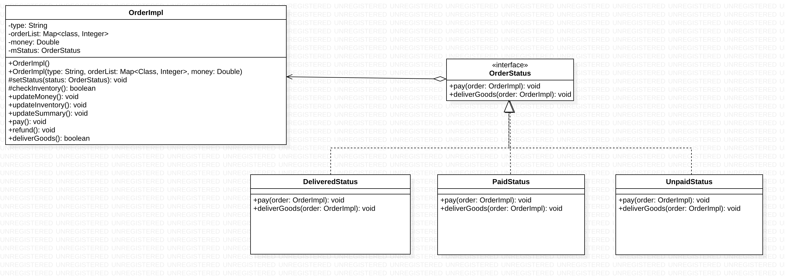
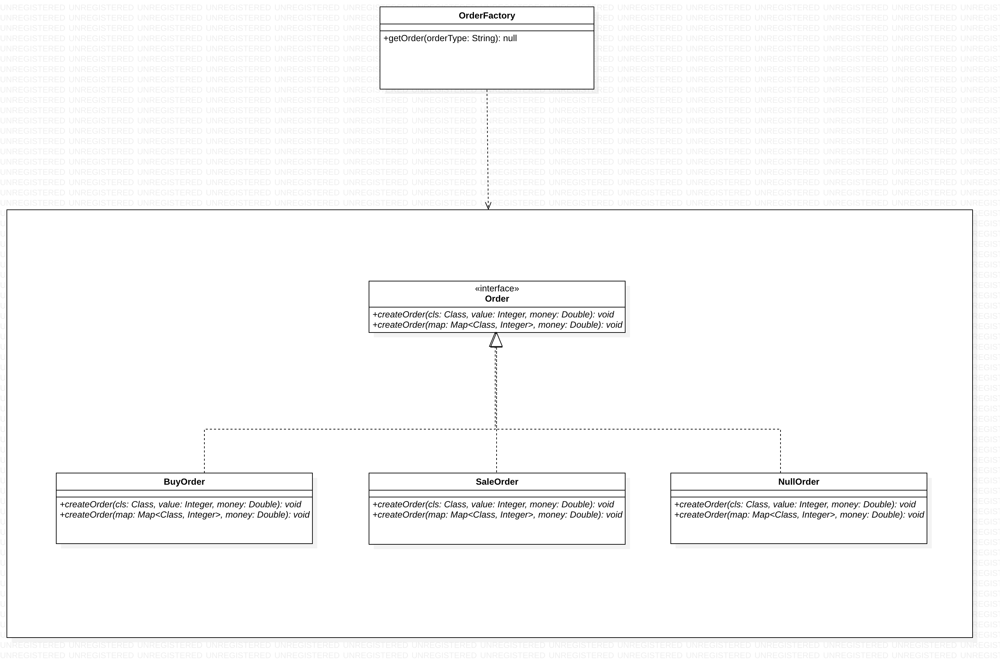

## Factory Pattern

### 设计模式简述

​	Factory 模式提供了一个创建一系列相关或相互依赖对象的接口，而无需指定它们具体的类。十分便捷的划分了不同产品组，但是在OCP原则的规范下难以实现产品组内的扩展，但可以实现产品组的扩展。

### Order 实现API

#### API描述

​	我们将该模式运用于订单的创建过程中，判断输入后可以在getOrder()中通过参数“Buy”或“Sale”创建BuyOrder或SaleOrder; NullOrder用于处理输入错误的情况。   

#### 类图

## State Pattern

### 设计模式简述

​	State模式允许对象在内部状态发生改变时改变它自身的行为，提供了方便的解决复杂对象状态转换的方法、解决了不同状态下行为的封装问题。优点是在逻辑上确定并枚举可能的状态与该状态下对应的行为方法，将状态与行为做逻辑关联，使得高层模块可以直接通过更改状态实现不同行为的选择；多个环境对象可以共享同一个状态模块，实现了代码的复用。但是在原有的结构基础上增加了不同的状态类与对象类，但在实现方法上得到了精简；对OCP原则不友好，增加新的状态时必不可少的要更改切换状态的源代码。

### API描述

​	我们以OrderState为基本状态接口，为植物类（OrderImpl）设立了三种状态：

| 类名           | 描述           |
| -------------- | -------------- |
| DeliveredState | 商品已交付阶段 |
| PaidState      | 已支付阶段     |
| UnpaidState    | 未支付阶段     |

​	三种状态的区别在于支付和商品交付动作 pay() 和 deliverGoods() 方法，同一订单在不同的阶段会有不同的方法，如在PaidState下该方法将会在收到商品交付命令后更新库存，并且重置当前订单的状态。

### 类图

## Null Object Pattern

### 设计模式简述

​	在空对象模式（Null Object Pattern）中，一个空对象取代 Null 对象实例的检查。Null 对象不是检查空值，而是反应一个不做任何动作的关系。这样的 Null 对象也可以在数据不可用的时候提供默认的行为。在空对象模式中，我们创建一个指定各种要执行的操作的抽象类和扩展该类的实体类，还创建一个未对该类做任何实现的空对象类，该空对象类将无缝地使用在需要检查空值的地方。

### API描述

​	我们将该模式运用于订单的创建过程中，NullOrder作为Order接口的实现，判断输入后可以在getOrder()中通过参数“Buy”或“Sale”创建BuyOrder或SaleOrder; NullOrder用于处理输入错误的情况。

### 类图

## Proxy Pattern

### 设计模式简述

​	在代理模式（Proxy Pattern）中，一个类代表另一个类的功能。这种类型的设计模式属于结构型模式。
在代理模式中，我们创建具有现有对象的对象，以便向外界提供功能接口。

#### API描述

以RepositoryProxy代理类来代理RepositoryImpl类，两者都是Repository接口的实现类。

| 方法名        | 描述                                                         |
| ------------- | ------------------------------------------------------------ |
| Instance      | 返回代理类的单例                                             |
| add           | 以类名与整数值，或者一个字典为参数，向仓库中添加对应项       |
| ask           | 以类名与整数值，或者一个字典为参数，向仓库请求使用对应项，如果剩余库存充足则直接消耗，返回true，否则返回false |
| showAllItems  | 在控制台输出仓库中储存的所有项与对应存量                     |
| checkItemNum  | 以类名为参数，返回仓库中该类所存储的存量。                   |
| getTotalValue | 返回仓库中所有项的总存量                                     |

  

#### 类图

## Singleton Pattern

### 设计模式简述

​	单例模式模式属于创建型模式，它提供了一种创建对象的最佳方式。这种模式涉及到一个单一的类，该类负责创建自己的对象，同时确保只有单个对象被创建。这个类提供了一种访问其唯一的对象的方式，可以直接访问，不需要实例化该类的对象。

### 3.20.1 API描述

​	我们以RepositoryProxy为单例，同时也是Repository接口的实现类、RepositoryImpl的代理类。

| 方法名   | 描述                          |
| -------- | ----------------------------- |
| Instance | 返回单例对象的RepositoryProxy |

### 3.20.2 类图

## Iterator Pattern

### 设计模式简述

​	迭代器模式用于顺序访问集合对象的元素，不需要知道集合对象的底层表示。迭代器模式属于行为型模式。

### 3.20.1 API描述

​	在RepositoryImpl类中，传入参数为Map类型的add、ask方法，处理Map使用的是迭代器模式，通过迭代器遍历整个字典，对于每一个迭代对象作为参数分别调用一次参数为<Class, Integer>的add/ask方法。

### 3.20.2 类图

## Observer Pattern

### 设计模式简述

​	当对象间存在一对多关系时，则使用观察者模式（Observer Pattern）。比如，当一个对象被修改时，则会自动通知它的依赖对象。观察者模式属于行为型模式。

#### API描述

Store类拥有自身所观察的被观察对象，当自身的update方法被调用时根据被观察对象的状态作出相应变更

| 方法名 | 描述                             |
| ------ | -------------------------------- |
| update | 根据被观察对象的状态作出相应变更 |

RepositoryProxy类拥有一个观察者列表，当自身状态变化时调用Notify方法，来通知每一个观察者

| 方法名             | 描述                                   |
| ------------------ | -------------------------------------- |
| attach             | 以观察者为参数，将观察者加入观察者列表 |
| NotifyAllObservers | 调用每一个观察者的update方法           |

  

#### 类图

## Singleton Pattern

### SingleStore实现API

####  API描述

​	我们将SingleStore定义为一个单例。可以通过getSingleStore()方法来获取SingleStore单例。并且构造函数为私有，不可以通过外部创建。

| 函数名                       | 作用                                 |
| :--------------------------- | ------------------------------------ |
| SingleStore getSingleStore() | 获取商店类的唯一实例instance并返回。 |

#### 类图

# Stategy Pattern

### SaleStrategy实现API

####  API描述

商店出售商品时选择了三种优惠方式：normalVIP，goldVIP，superVIP分别对订单总价采用不同的折扣来进行销售，订单的选择根据仓库的反馈来进行更新，当仓库库存接近溢出时采取较大的折扣，当仓库库存不足时，采用较小的折扣。

| 函数名                                                    | 作用                                           |
| --------------------------------------------------------- | ---------------------------------------------- |
| Double doStrategy(Double money)                           | 具体计算使用优惠策略后所需要支付的金额         |
| Double calculatePrice(SaleStretagy stretagy,Double price) | 调用strategy的doStretagy（）方法来执行策略     |
| Double useStretagy(Double initialPrice)                   | 商店实例通过输入原价来获取使用优惠策略后的价格 |

| 类名      | 描述                                     |
| --------- | ---------------------------------------- |
| normalVIP | 普通会员打九折，在库存接近空时采用       |
| goldVIP   | 黄金会员打八折，在库存处于正常范围时使用 |
| superVIP  | 超级会员打七折，在库存接近饱和时使用     |

#### 类图

